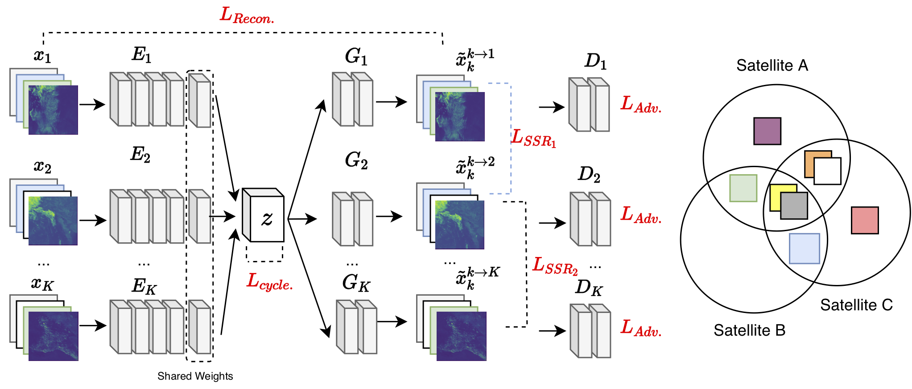

# Spectral Synthesis for Satellite-to-Satellite Translation

(In progress)

## Model

VAE-GAN Architecture forr unsupervised image-to-image translation with shared spectral reconstruction loss. Model is trained on GOES-16/17 and Himawari-8 L1B data processed by GeoNEX. 



## Dependencies

conda install pytorch, xarray, petastorm, numpy, pyhdf, scipy, pandas, torchvision 

## Steps to Reproduce Experiments

### Build Training Datasets

```
cd data <br>
python write_data_to_petastorm.py /nex/datapool/geonex/public/GOES16/GEONEX-L1G/ WRITE_DIRECTORY G16 --year 2018 --max_files 100
python write_data_to_petastorm.py /nex/datapool/geonex/public/GOES17/GEONEX-L1G/ WRITE_DIRECTORY G17 --year 2018 --max_files 100
```

### Run Training script

Train model with a given configuration file with data and model parameter.  See `configs/Base-G16G17.yaml` and `configs/Base-G16G17H8.yaml` as examples.

```
python train_net.py --config_file configs/Base-G16G17.yaml
```

Training can be visualized using tensorboard
```
tensorboard --logdir EXPERIMENT_DIRECTORY
```

### Perform Inference

Work in progress <br>
Current inference examples can be found in notebooks/


### Known Challenges

This model estimated the lower bound of log-likelihood effectively causing reduced spatial resolution. The latent space is only appoximately cycle consistent. Recent developed in invertible methods (eg. AlignFlow) solves this problem deterministically with maximum likelihood.
